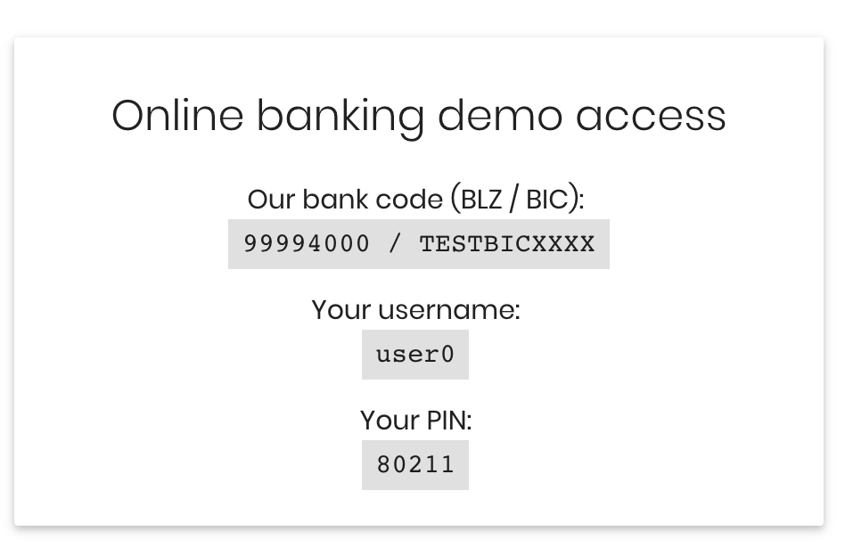

# AHOI API Node.js Client

[](https://github.com/sparkassen-hub/ahoi-nodejs-client)

## API Docs

**&rarr; [API
Docs](https://sparkassen-hub.github.io/ahoi-nodejs-client/classes/ahoiapifactory.html)**

## AHOI - Open Banking API

The AHOI Open Banking API provides easy access to banks and payment service providers.
The API can be used to retrieve account and deposit account information, execute transfers,
determine forecasts, and more.

Get more information about the AHOI API and API docs here:

* [AHOI Cookbook](https://banking-sandbox.starfinanz.de/ahoi/docs/cookbook/index.html)
* [AHOI Explorer](https://banking-sandbox.starfinanz.de/ahoi/docs/api/swagger-ui/index.html#!/resource/Access)
* [AHOI Demo-Account](https://banking-sandbox.starfinanz.de/sandboxmanager/)
* [AHOI Node.js API Docs](https://sparkassen-hub.github.io/ahoi-swagger-fetchclient/modules/_api_.html)

## AHOI Node.js Client

This Node.js module provides easy access to banks via the AHOI Open Banking API. The client module is designed to be used within an existing Node.js application. It extends it with the feature  to get accesses to bank data such as account transactions or deposit data.

To simply try out the client or as a starting point for your own application, we recommend
our demo application which uses this client:

* [AHOI Node.js Demo App](https://github.com/sparkassen-hub/ahoi-nodejs-demo-app)

## Getting Started

### Prerequisites

* Node.js in Version 10.0.0 oder höher. Die Installation ist hier beschrieben : [Node.js download](https://nodejs.org/en/download/).
* Eine Node.js-Anwendung, in die das Modul als Abhängigkeit eingebunden wird.

### Install the node module

```bash
npm install --save git+ssh://git@github.com:sparkassen-hub/ahoi-nodejs-client.git
```

### Create an AHOI demo account

Go to [AHOI Demo-Account](https://banking-sandbox.starfinanz.de/sandboxmanager/) and register for a
demo account.

### Get bank account transactions in 5 steps

To get account transactions for an user you have to manage five steps:

1. Create a new user in AHOI (technically: retrieve an installationId)
2. Let the user select a bank
3. Create bank access with PIN and username
4. (Optional) Select one or more accounts (default is all)
5. Show the transactions for the selected accounts

### Quickstart

The following code snippets show how to technical implement the steps from creating a user in AHOI
to retrieving account transactions.

A) Include the module in your code

```typescript
// Typescript
import { AhoiApiFactory } from 'ahoi-api-node';

// JavaScript
const { AhoiApiFactory } = require('ahoi-api-node');
```

B) Add the configuration to access the AHOI API

```typescript
// Configuration: see information below
const ahoiConfig = {
  clientId: 'SBM_XXqaeX30T2D',
  clientSecret: '2e066yXXXLxa3zn',
  appSecretIv: 'mP3IdoOKxVzOQzX22IueXg',
  appSecretKey: 'dGw6XXtcyryKqXeeHgqPTg',
  cryptKey: 'ScL&aFPazDw6S#k3',
  baseurl: 'https://banking-sandbox.starfinanz.de/ahoi/api/v2',
};

const ahoiApi = new AhoiApiFactory(ahoiConfig);
```

C) Create a new user in AHOI

```typescript
// Get an installationid (and store it in your user management system)
const registrationApi: RegistrationApi = await ahoiApi.getRegistrationApi();
const installationId: RegistrationResponse = await registrationApi.register();
```

D) Let the use select a bank, get a list of banks before

```typescript
// Get a list of(banking) providers
const providerApi: ProviderApi = await ahoiApi.getProviderApi(installationId);
const providers: Provider[] = await providerApi.getProviders();
```

E) Create bank access with PIN and username

The bank access is linked with the installationId

```typescript
// Grant banking access by a user
const accessApi: AccessApi = await ahoiApi.getAccessApi(installationId);
// To grant banking access the user must provide the pin and username or customernumber. It differs
// from bank to to bank which data additionally to the pin are needed.
const access: Access = {  
                          type: 'BankAccess',
                          providerId: provider[0].id,
                          accessFields: {
                                          USERNAME: username,
                                          CUSTOMERNUMBER: customernumber,
                                          PIN: pin,
                                        },
                        };
const allowedAccess: Access = await accessApi.postAccess(access);
```

E) Select accounts.

As AHOI initially fetches all accounts from a bank access, the accounts not
selected by user must be deleted from AHOI.

```typescript
// Delete banking accounts from AHOI or show as list
const accountApi: AccountApi = await ahoiApi.getAccountApi(installationId);
// accessid comes from banking access granted before: Access#id
const accounts: Account[] = await accountApi.getAccounts(allowedAccess.id);
await accountApi.deleteAccount(allowedAccess.id, accounts[0].id);
```

F) Show account transactions

```typescript
// Show transactions for a bank account
const accessApi: AccessApi = await ahoiApi.getAccessApi(Server.INSTALLATION_ID);
        const transactions: Asset[] = accessApi.listAssets(accessId, accountId, 30);
```

### Configuration

The AHOI access data (**clientId**, **clientSecret**, **appSecretIv**, **appSecretKey**) can be found in your AHOI
(demo) account.


The **cryptKey** is used to encrypt the installationId internally before it is stored e.g. in a user
mangement system. This way it is ensured, that the installationId for an user is always stored
encrypted.

You can choose any password as cryptKey, but the recommended length is 32 chars.

### Test it with your demo account

To get transactions for a bank account, you have to grant access before. But for sure you don't want
to use your real bank access data.

Exactly for this AHOI has (technically) created a demo bank called Sandbank. After registration at
AHOI you have automatically two demo accounts at this bank. You'll find your access
data (PIN and username) in your AHOI account.

When testing the client you should select as bank the 'Sandbank'. To grant access to the bank use
the PIN and username from your AHOI account (see below).



### InstallationId

An installationId is needed to fetch account data for an user. In AHOI it is not linked with a user
but only with one or more accounts. Therefore the following procedure should be chosen:

1. Fetch installationId from AHOI
2. Save installationId for an user e.g. within your user management
3. Add bank accesses to this installationId
4. Retrieve transactions for an user using the installationId linked to the user

## Build from source

```bash
# Build
npm run build

# Generate TS doc separate
npm run doc
```

## License

Licensed under [MIT](./LICENSE).
